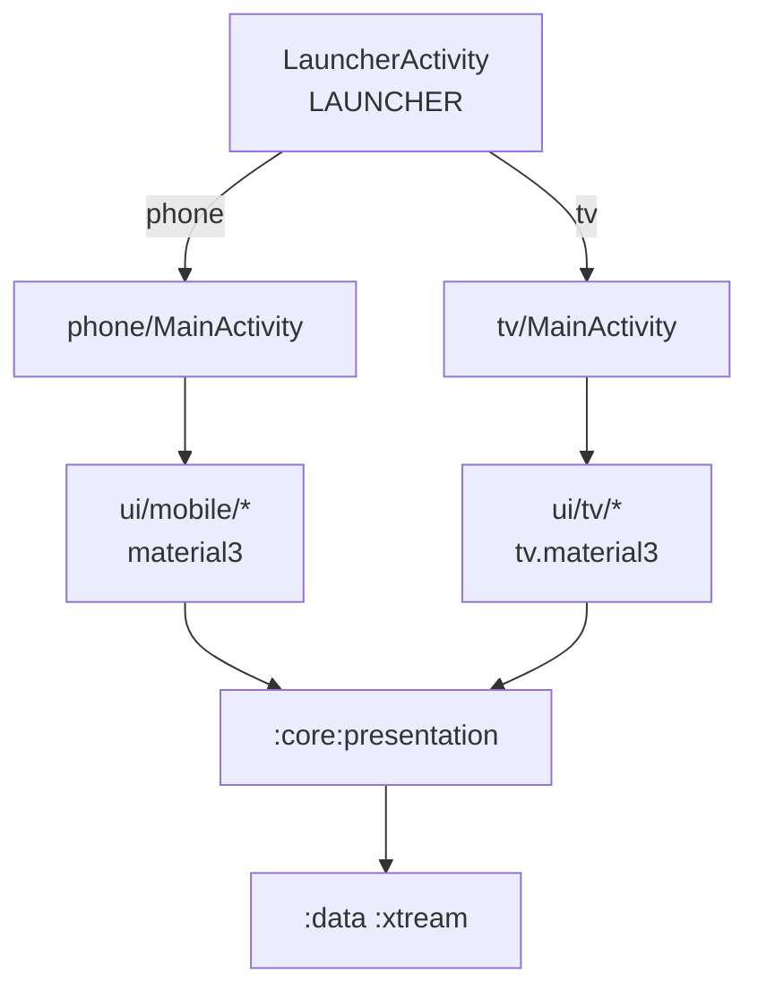

# Compose Architecture — FireTv (2-в-1)

См. [MasterPrompt.md](../MasterPrompt.md), [Roadmap.md](../Roadmap.md).

## Принцип

Один universal APK. **Детект только в Launcher.** Две независимые Activity — без `when(isTv)` в Compose.



## Структура пакетов

```
app-compose/
  launcher/LauncherActivity.kt
  phone/MainActivity.kt          → PhoneNavHost
  tv/MainActivity.kt             → TvNavHost
  ui/mobile/PrettyButton.kt
  ui/tv/PrettyButton.kt          # зеркало
  ui/mobile/category/CategoryScreen.kt
  ui/tv/category/CategoryScreen.kt
```

## Что общее / что раздельное

| Общее (`:core`) | Раздельное |
|-----------------|------------|
| ViewModels, UiState | Activity + NavHost |
| Repositories, use cases | Theme |
| Route sealed class (имена) | Все `@Composable` в ui/mobile vs ui/tv |

## Screen pattern

```kotlin
// ui/mobile/category/CategoryScreen.kt — production, без параметров
@Composable
fun CategoryScreen() {
    val vm: CategoryViewModel = viewModel()
    val state by vm.uiState.collectAsState()
    CategoryScreenBody(
        categories = state.categories,
        isLoading = state.isLoading,
        onCategoryClick = vm::onCategoryClick,
    )
}

// mockScreens/CategoryScreen.kt — Preview
@Preview @Composable
fun CategoryScreenPreview() = CategoryScreen() // MOCK внутри Screen
```

См. `guidelines/SCREEN_SCREENBODY.md`.

## Legacy

`:app` (XML) остаётся до cutover. `app-compose` — новая точка входа после переключения applicationId.
