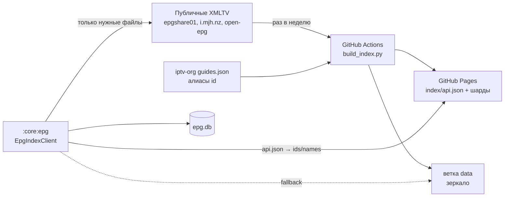

# EPG (программа передач): сервер + клиент

Две части: **серверная** — отдельный репозиторий `epg-index` (индекс каналов на GitHub Pages),
**клиентская** — модуль `:core:epg` (lookup в индексе, загрузка XMLTV, `epg.db`).



Сервер **не хранит программу** — только «какой канал в каком XMLTV-файле и под каким id».
Программы приложение качает с первоисточника и парсит само.

## Серверная часть — `epg-index`

| | |
|---|---|
| Репозиторий | https://github.com/ishumakov881/epg-index (локально `C:\Users\reznichenko.i\Desktop\index-egp`) |
| Точка входа | https://ishumakov881.github.io/epg-index/index/api.json |
| Зеркало | `https://raw.githubusercontent.com/ishumakov881/epg-index/data/index/…` (ветка `data`, один force-push коммит) |
| Сборка | `.github/workflows/build.yml`: пн 03:17 UTC, вручную (Run workflow), push в `main` (`sources.json`, `build_index.py`, `epgkeys.py`, workflow), тег `build-*` |
| Что делает CI | только сборка + публикация (Pages + `data`). Тестов в CI нет — гоняются локально |
| Защита | сборка не публикуется, если прочитано < 10000 каналов (`--min-channels`) |

Файлы:

- `sources.json` — источники XMLTV (listing/pattern или явные URL, `channels_first`) и URL алиасов iptv-org.
- `epgkeys.py` — нормализация ключей и шардинг. **Должен совпадать с `EpgKey.kt`.**
- `build_index.py` — скачивает, парсит `<channel>`, сводит, пишет `dist/index/*`.
- `resolve.py` — эталонный клиент (то же, что делает приложение). `report.py` — отчёт покрытия.
- `tests/test_api.py` — контрактные векторы, целостность сборки, сценарии плейлистов.

Опубликованный API:

| Файл | Содержимое |
|---|---|
| `index/api.json` | `shards` (256), шаблоны путей, размеры gzip (`idsFullGzip`, `idsShardGzipAvg`, …), `requestCostBytes`, `sources[]` (`u` = URL XMLTV) |
| `index/ids.json`, `index/ids/NNN.json` | `ключ tvg-id → [guideChannelId, [индексы sources], icon?]`; шарды = разбиение полного файла |
| `index/names.json`, `index/names/NNN.json` | то же по ключу названия; только однозначные названия |
| `index/<cc>.json`, `index/manifest.json` | по странам (детали, названия), статус источников |

Локальный прогон (Python 3.10+, только stdlib):

```powershell
cd C:\Users\reznichenko.i\Desktop\index-egp
python build_index.py                       # → dist/
python -m unittest discover -s tests -v
python resolve.py $env:TEMP\es.m3u --local dist
```

Добавить источник — `sources.json`, затем push в `main` (CI пересоберёт).

## Контракт (общий для сервера и приложения)

- `id key`: текст до `@`, trim, lowercase, только буквы/цифры. `BBCNews.uk@HD` → `bbcnewsuk`.
- `name key`: NFKD без диакритики, lowercase, без `(…)`/`[…]`, без слов качества
  (`hd fhd uhd sd 4k 8k hevc h264 h265 720p 1080i …`), только `[0-9a-z]`. Нелатинские названия → нет ключа.
- Шард: `CRC32(utf8(key)) % shards`, в путях 3 цифры. Вектор: `CRC32("123456789") = 0xCBF43926` → шард 38.
- Полный файл вместо шардов, если `нужно_шардов × (ShardGzipAvg + requestCostBytes) ≥ FullGzip`.
- Порядок: сначала по `tvg-id`, ненайденные — по названию.

Меняешь нормализацию — меняй **одновременно** `epgkeys.py` и `EpgKey.kt` и векторы в
`tests/test_api.py` + `EpgKeyTest.kt`.

## Клиент — `:core:epg`

| Класс | Роль |
|---|---|
| `EpgKey` | `normalize` (id), `nameKey`, `shardOf` |
| `index/EpgIndexClient` | `resolve(List<EpgChannelRef>)` → совпадения + какие файлы гайда; потоковый Gson, держит только нужные ключи. `EpgIndexClient.http(okHttp)` — Pages, затем `data` |
| `index/EpgSourcePlan` | по одному XMLTV-файлу на канал, минимизируя число файлов |
| `EpgStore.syncFromIndex(channels)` | lookup → `channel_map` → `sync(url, guideIds)` на каждый файл |
| `EpgStore.nowNextFor(channels)` / `schedule(ref, …)` | `channel_map`, иначе прямой `tvg-id` (гайд из `url-tvg` плейлиста) |
| `EpgStore.sync(url, tvgIds)` | прямой XMLTV (`url-tvg` / `x-tvg-url`, `M3UParser.parseHeaderEpgUrls`) |

`EpgChannelRef(tvgId, name)`: M3U `tvg-id` / Xtream `epg_channel_id` + название канала
(`ChannelUi.tvgId`, `ChannelUi.name`). Иконку из индекса (`EpgIndexSyncResult.icons`)
использовать только если у канала нет `tvg-logo`.

`sync` заменяет программы файла целиком → в `syncFromIndex` передавать все каналы активного плейлиста.

Тесты (JVM): `.\gradlew.bat :core:epg:testDebugUnitTest`. Сверка с реальной сборкой:
`$env:EPG_INDEX_DIST='…\index-egp\dist'; $env:EPG_LIVE_M3U='…\es.m3u'` → `EpgIndexDistTest`
печатает то же, что `resolve.py --local dist`.

Покрытие на 2026-09-29 (Kotlin = Python):

| Плейлист | Каналов | По id | По названию | Итого |
|---|---|---|---|---|
| iptv-org `countries/es` | 323 | 102 | 18 | 37% |
| iptv-org `categories/news` | 1003 | 310 | 60 | 37% |
| iptv-org `index` | 10994 | 2445 | 782 | 29% |
| `index` без `tvg-id` | 10994 | — | 1669 | 15% |

## В приложении (`:app-compose`)

- `epg/EpgSync` — фоновый `syncFromIndex` в app-wide scope. Запуск: `TvNavHost` / `PhoneNavHost`
  слушают `ChannelRepository.observeAllChannels()`, ждут 5 с тишины, затем `EpgSync.request`.
  Не чаще раза в 12 ч для того же набора каналов (`shared_prefs/epg_sync.xml`); если часть файлов
  упала — повтор через 1 ч. Максимум `EpgStore.DEFAULT_MAX_FILES` (12) файлов гайда — самые «покрывающие».
- `ui/components/ChannelEpg.kt`: `rememberChannelNowNext(channel)` (перезапрос по `EpgStore.version`
  и по концу текущей передачи), `ChannelEpgNowStrip` — полоса «сейчас» + прогресс внизу логотипа
  (карточки сетки TV/phone, высота карточки не меняется), `ChannelEpgNowNextLines` — «сейчас / далее»
  в строках списка. Debug-чип `tvg-id` переехал в TopStart логотипа.

Проверено 2026-10-01 (LDPlayer, `index.m3u` 10994 канала): id 2445 + name 740, 12/12 файлов,
~60 тыс. передач в окне −2 ч…+36 ч, синк ~3,5 мин.

Грабли:
- Android ICU regex не понимает `(?U)` → `EpgKey` использует явные `\p{L}\p{N}` lookaround вместо `\b`.
- Часть epgshare01 файлов начинается с UTF-8 BOM → `XmlTvStreams.reader` его пропускает.

## Не сделано

- Экран полной программы канала (`EpgStore.schedule`).
- Подстановка иконки из индекса в карточки без `tvg-logo` (`EpgIndexSyncResult.icons` пока не сохраняются).
- Гайд из `url-tvg` самого плейлиста (`M3UParser.parseHeaderEpgUrls` есть, URL нигде не хранится).
- На устройстве по названию находится 740 каналов `index.m3u`, а в JVM-тесте 782: имена из БД
  отличаются от сырых M3U — не разбиралось.
